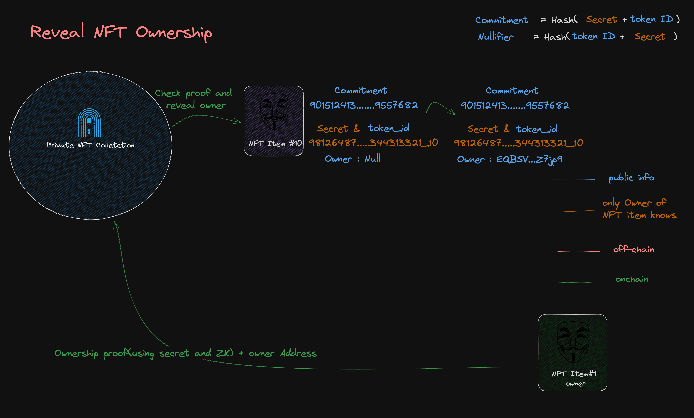

- **TEP**: [0](https://github.com/ton-blockchain/TEPs/pull/0) *(don't change)*
- **title**: Private NFT Standard *(ZK)*
- **status**: Draft
- **type**: Contract Interface
- **authors**: [Saber](https://github.com/SaberDoTcodeR)
- **created**: 01.08.2023
- **replaces**: [TEP-62](https://github.com/ton-blockchain/TEPs/blob/master/text/0062-nft-standard.md)
- **replaced by**: -

# Summary

A Standard on top of TON NFT standard to enable private transfers and private ownership of NFTs using Zero-Knowledge.

# Motivation

TON NFT standard is a great standard for NFTs, but it lacks privacy. As an example, if Alice owns a Telegram Anonymous Number/ Telegram Username NFT, her TON Identity will be fully linked to her Telegram identity. 
There should be an option for users to preserve their privacy while their ownership of NFTs is still verifiable fully on-chain.

Additional feature on top of TON NFT standard are:

- Private Transfer of NFT ownership without revealing the sender, receiver, or the NFT Item itself.
- An option for NFT owners to reveal their ownership(like normal TON NFTs)
- An option for NFT owners to shield their ownership after they reveal it.
- Generation of a Zero-Knowledge Proof for the NFT ownership(verifiable off-chain for third parties)

# Guide

As mentioned in the [TEP-62](https://github.com/ton-blockchain/TEPs/blob/master/text/0062-nft-standard.md#guide), Non-Fungible Token (NFT) represents an ownership over unique digital asset. And based on that implementation there are 1 NFT Collection and N NFT Item contracts. Each deployed NFT Item contract has an owner address in their datacell. In this standard we will avoid that and prove ownership only with Zero Knowledge Proofs.


# Specification

NFT Item contract will stay intact, but the NFT Collection contract will be modified to support Private Transfers, Reveal and Shield.

## NFT Item Contract
It will be exactly the same as the [TEP-62](https://github.com/ton-blockchain/TEPs/blob/master/text/0062-nft-standard.md#nft-item-smart-contract) implementation. We won't need to change anything here.

## NFT Collection Contract

Besides the already implemented functions, we will add the following functions:

Must implement:

### Internal message handlers
### 1. `private_transfer`


**Request**
To preserve privacy of the sender, a relayer should this message to the NFT Collection contract on behalf of the NFT Item Owner. 
TL-B schema of inbound message:

```
private_transfer#111 query_id:uint64 proof_payload:^ProofPayload = InternalMsgBody;

_ root:uint256 nullifier:uint256 newCommitment:uint256 proof_points:^[ pi_a:^[ a: (## 384)] pi_b:^[ b: (## 768)] pi_c:^[ c: (## 384)] ] = ProofPayload;
  ```

`query_id` - arbitrary request number.

`proof_payload` - proof payload cell required for the proof verification.

`root` - root of the Merkle Tree *(Implementation will be explained later)*

`nullifier` - to avoid double spending, we will use a nullifier to mark the commitment as spent. You can't map a nullifier to a commitment!

`newCommitment` - the new commitment that will own the NFT Item after the transfer.

`proof_points` - the proof points that will be used in the pairing check to verify the proof. It can only be generated by the secret key owner.

**Should be rejected if:**

1. if any of the inputs are bigger than bls12-381 curve order *(52435875175126190479447740508185965837690552500527637822603658699938581184513)*.
2. if the nullifier is already spent.
3. if the root is not the same as any of the roots in the History Merkle Tree.
4. if the proof is not valid and the pairing check fails.

**Otherwise should do:**

1. insert the newCommitment to the History Merkle Tree.
2. mark the nullifier as spent.


### 2. `reveal`
**Request**





TL-B schema of inbound message:

```
reveal#112 query_id:uint64 proof_payload:^ProofPayload = InternalMsgBody;

_ root:uint256 nullifier:uint256 owner:MsgAddress token_id:uint32 proof_points:^[ pi_a:^[ a: (## 384)] pi_b:^[ b: (## 768)] pi_c:^[ c: (## 384)] ] = ProofPayload;
  ```

`query_id` - arbitrary request number.

`proof_payload` - proof payload cell required for the proof verification.

`root` - root of the Merkle Tree *(Implementation will be explained later)*

`nullifier` - to avoid double spending, we will use a nullifier to mark the commitment as spent. You can't map a nullifier to a commitment!

`owner` - the address of the owner of the NFT Item after the reveal.

`token_id` - the token id of the NFT Item.

`proof_points` - the proof points that will be used in the pairing check to verify the proof. It can only be generated by the secret key owner.

**Should be rejected if:**

1. if any of the inputs are bigger than bls12-381 curve order *(52435875175126190479447740508185965837690552500527637822603658699938581184513)*.
2. if the nullifier is already spent.
3. if the root is not the same as any of the roots in the History Merkle Tree.
4. if the proof is not valid and the pairing check fails.

**Otherwise should do:**

1. send a message to the NFT Item contract to change the owner to the new owner.
2. mark the nullifier as spent.


### 3. `shield`
**Request**


This is the forward payload of NFT item transfer to NFT collection contract. It will be used to shield(hide) the ownership of the NFT Item.

TL-B schema of inbound message:

```
ownership_assigned#05138d91 query_id:uint64 prev_owner:MsgAddress forward_payload:^ShieldMessage = InternalMsgBody;

_ commitment:uint256 token_id:uint32 = ShieldMessage;
  ```

`query_id` - arbitrary request number.

`commitment` - the commitment of the NFT Item which will be inserted to the History Merkle Tree.

`token_id` - the token id of the NFT Item.

**Should be rejected if:**

1. if the sender is not the NFT Item address.

**Otherwise should do:**

1. insert the commitment to the History Merkle Tree.


# Drawbacks

Why should we *not* do this?

# Rationale and alternatives

- Why is this design the best in the space of possible designs?
- What other designs have been considered and what is the rationale for not choosing them?
- What is the impact of not doing this?

# Prior art

Discuss prior art, both the good and the bad, in relation to this proposal. How the problem stated in "Motivation" section was solved in another blockchains? This section encourages you as an author to learn from others' mistakes. Feel free to include links to blogs, books, Durov's whitepapers, etc.

# Unresolved questions

If there are some questions that have to be discussed during review process or to be solved during implementation of this TEP, write it here.

# Future possibilities

Do you have ideas, which things can be implemented on top of this TEP later? Write possible ideas of new TEPs, which are related to this TEP.
